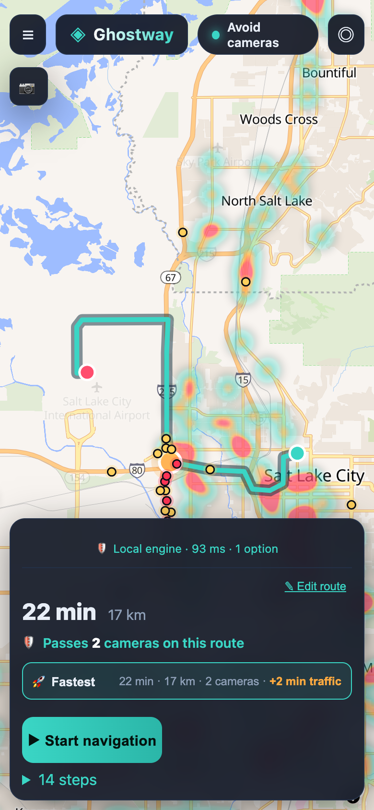
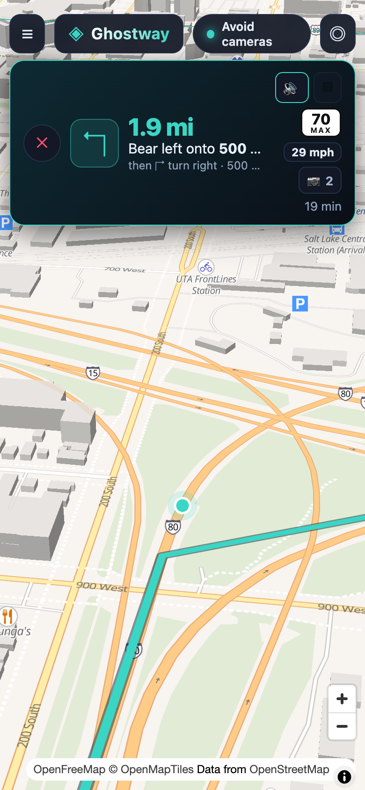

# Ghostway

**Navigate beyond surveillance.**

Ghostway is a free, open-source turn-by-turn navigation web app that — by
default — routes you around known automated license plate reader (ALPR)
cameras, including Flock Safety's. Your drive stays yours.

> **Live demo:** <https://deseretsaint.github.io/ghostway/> (best experienced
> on a phone — it's an installable PWA)

> Mission: get people where they need to go without being logged by mass
> surveillance cameras.

| Route options — ETA + camera count *before* you pick | Turn-by-turn with live camera counter |
|:---:|:---:|
|  |  |

## Why

ALPRs (Flock Safety and others) photograph every passing vehicle and log its
location, time, and identifying features, then share that data with thousands
of agencies — usually without a warrant. Ghostway uses the open
[DeFlock](https://deflock.org) camera map (130,000+ known cameras nationwide)
to keep you off those roads by default.

## Ground rules

- 100% open source — GPL-3.0-or-later
- **No API keys**, no account, free forever
- **No telemetry, no tracking, no analytics** — your routes never leave your
  device except as requests to the open servers listed below

## Feature highlights

- **Camera-aware routing engine** — Ghostway builds its own road graph from
  OpenStreetMap with camera exposure baked into every road segment, then runs
  A* on-device. No third-party routing service decides where you go.
- **Three avoidance modes**: *Strict* (bend over backwards for zero cameras),
  *Moderate* (avoid most, keep the detour sensible), *Off* (fastest). Per-mode
  ETA + camera count shown **before** you pick.
- **Route options** — Clearest / Balanced / Fastest with distance, ETA, and
  camera count on each, Magic Earth style.
- **Live traffic** — Utah: UDOT open incidents (closures, roadwork) slow
  affected road segments. Nationwide: a daily-refreshed harvest of every
  state's open WZDx work-zone feed adds work zones and avoids hard closures
  outside Utah. No key required anywhere.
- **Turn-by-turn navigation** — voice guidance (offline, Web Speech API),
  distance countdown, next-step preview, speed limits, live GPS speed.
- **Follow mode** — heading-up 3D driving camera, pan to look around, tap 🧭
  to recenter. Off-route auto re-routes through the camera-aware engine.
- **Camera-ahead warnings** — voice + red banner flash ~250 m before a camera
  you'll pass, and a live 📷 counter of cameras passed on the trip.
- **Over-speed alerts** — GPS speed vs the posted limit.
- **Waypoint drag** — drag the orange handle on any route preview to reroute
  through a point of your choosing.
- **Report-a-camera** — spotted one we don't know about? Drop a pin. It
  protects routes immediately on your device, and you can publish it to
  OpenStreetMap (anonymous, no account) so the DeFlock map grows.
- **Installable PWA** — add to home screen; the app shell, map tiles, and
  camera data cache for offline use.

## The routing stack (three tiers)

| Tier | Engine | Coverage | Notes |
|---|---|---|---|
| 1 | **Ghostway's own graph** | Wasatch Front (SLC → Santaquin), 550k road edges | On-device A*, camera + traffic costs, 9–300 ms per route |
| 2 | **Valhalla** (public demo) | Worldwide | Key-free, CORS-open; camera avoidance via `exclude_locations` |
| 3 | **BRouter + OSRM** | Worldwide | Legacy fallback of last resort (flaky public servers) |

Tier selection is automatic per corridor. Self-hosting Valhalla for higher
limits is documented in [`docs/valhalla-docker.md`](docs/valhalla-docker.md) —
point `CONFIG.valhallaUrl` at it and nothing else changes.

## How camera avoidance works (own engine)

1. OpenStreetMap roads are filtered to drivable ways and compiled into a
   compact binary graph (`engine/build-graph.mjs`, ~7 MB gzipped for the
   Wasatch Front).
2. Every DeFlock camera is scored onto nearby road segments: ALPR brands
   (Flock, Motorola, Rekor, …) and traffic-facing cameras get full weight,
   other surveillance half weight.
3. A* routes with a cost of `travel time + junction delay + camera exposure ×
   mode weight`. Strict mode weights exposure ~10× higher than Moderate.
4. Community-reported cameras are merged into the exposure at plan time, so
   they protect routes immediately.

## Data sources (all open, all key-free)

| Need | Source | License |
|---|---|---|
| Base map | OpenStreetMap via [OpenFreeMap](https://openfreemap.org) | ODbL |
| Cameras | [DeFlock](https://deflock.org) (OSM + volunteers) | ODbL / CC-BY |
| Live traffic (Utah) | UDOT open events (services6.arcgis.com) | public |
| Work zones (national) | Every state's open WZDx feed (data.transportation.gov registry) | public |
| Search | [Photon](https://photon.komoot.io) (OSM) | AGPL |
| World routing | [Valhalla](https://github.com/valhalla/valhalla) demo | MIT |
| Map engine | [MapLibre GL JS](https://maplibre.org) | BSD-3 |

The camera snapshot, national work-zone snapshot, and graph data refresh
automatically via GitHub Actions (`camera-refresh.yml`,
`wzdx-national-refresh.yml`). No proprietary tile servers anywhere.

## Run it yourself

```bash
npm install
npm run dev          # http://localhost:5173
```

Build a static, self-hostable bundle:

```bash
npm run build        # -> dist/
npm run preview
```

Serve `dist/` from any HTTPS origin — that's all it needs (HTTPS is required
for geolocation and PWA install on mobile). The repo's
`.github/workflows/deploy.yml` publishes every push to `main` to GitHub
Pages automatically.

Optional data chores (both also run monthly in CI):

```bash
node scripts/fetch-cameras.mjs   # refresh camera snapshots (app fallback + graph input)
node engine/build-graph.mjs      # rebuild the road graph from the Utah OSM extract
```

## Configuration

Everything swappable lives in `src/config.js`:

- `valhallaUrl` — point at a self-hosted Valhalla for national routing without
  public-demo rate limits
- `osmNotesUrl` — community-report publishing endpoint
- `donate.*` — your Ko-fi / GitHub Sponsors / Liberapay / wallet addresses
  (the donate prompt encourages but never blocks)

## Privacy

Ghostway stores nothing about you. Camera reports live in your browser's
localStorage until you choose to publish them — and publishing is an anonymous
OpenStreetMap note, no account. Searches and routes go only to the public
open-source servers above. There is no analytics and never will be.

## Testing

20 automated suites (`scripts/*.mjs`) cover routing, avoidance, the full UI
with real mouse hit-testing, simulated GPS drive-throughs, traffic, ETA
accuracy, and the report flow. Run any of them after `npm run build`;
`smoke.mjs` and `interact-check.mjs` are the fast core pair.

## License

GPL-3.0-or-later. Built to stay free.
